# Create Transaction Review Process

## Introduction

In this lab we will create Transaction review process using Integrations created in previous lab.

Estimated Time: 30 mins

### About Process Automation

Oracle Cloud Infrastructure Process Automation is a native service for developers and business experts to quickly automate approval workflows that span your ERP, HCM, and CX systems. Simplify repetitive tasks with reusable business rules, prebuilt integrations, and low-code designers.

### Objectives

In this lab, you will:

* Create Transaction Review Process
* Run Transaction Review Process for Approved or Rejected cases

### Prerequisites (Optional)

This lab assumes you have:

* An Oracle Cloud account
* Access to Oracle Integration Cloud Instance Generation 3 and Oracle Process Automation Instance
* Integration Services in previous lab has been created and tested.

## Create Process

Create Transaction Review Process

   1. Add the following to your manifest.json in the top section:
   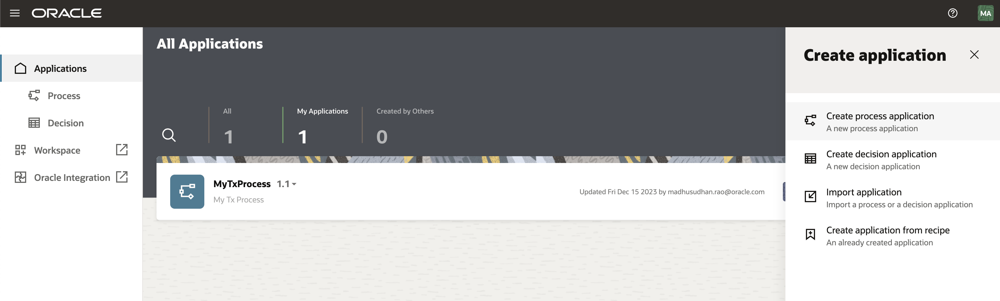
   2. A
   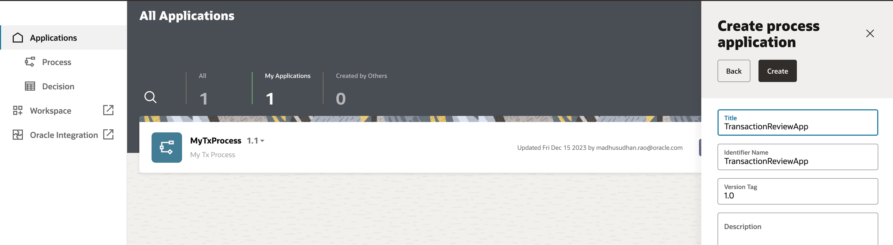
   3. A
   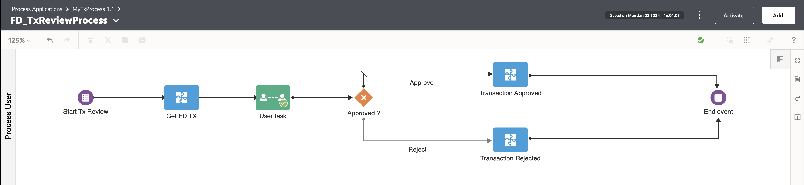  
   4. A
   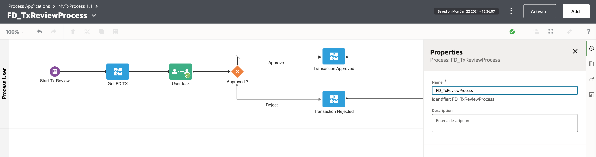
   5. A
   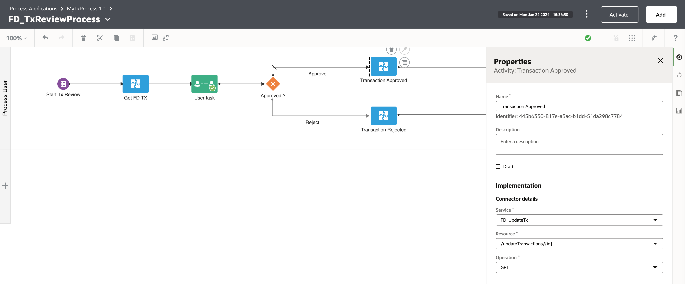
   6. A
   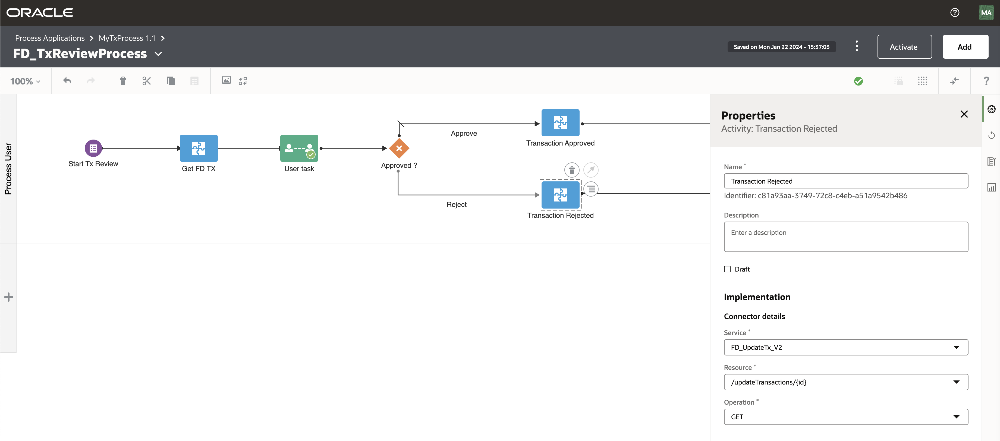
   7. A
   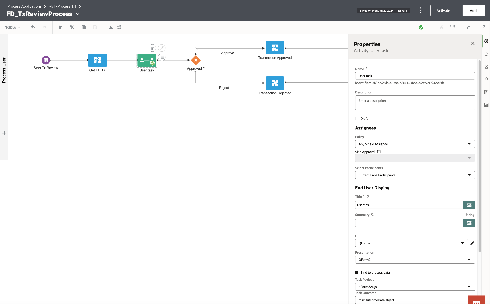
   8. A
   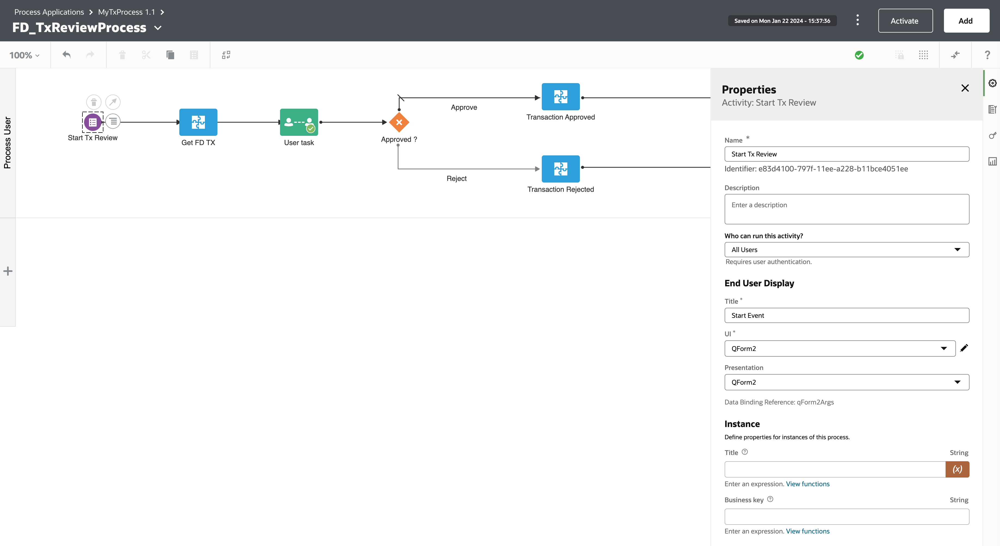
   9. A
   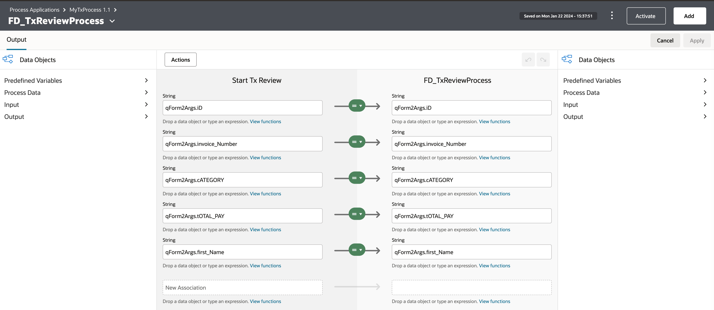
   10. A
   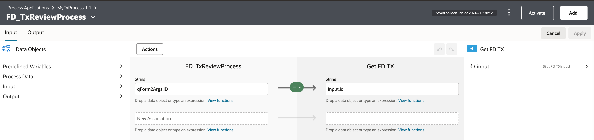
   11. A
   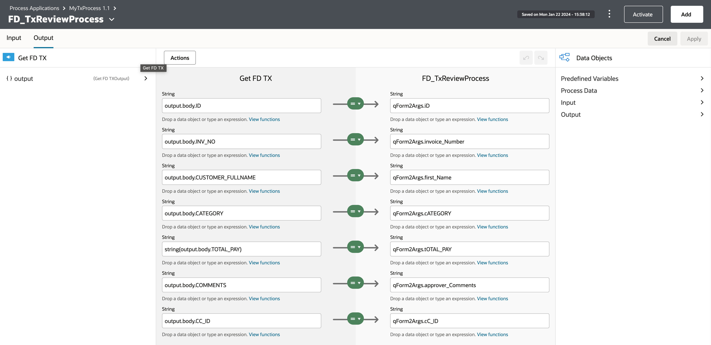
   12. A
   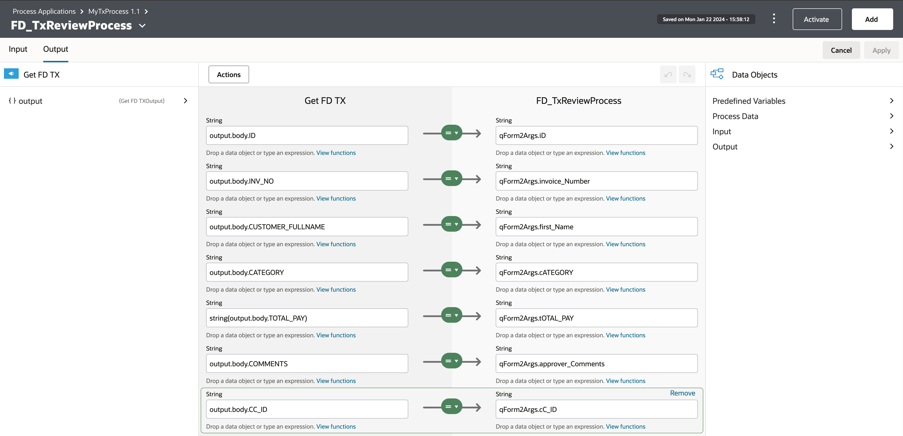
   13. A
   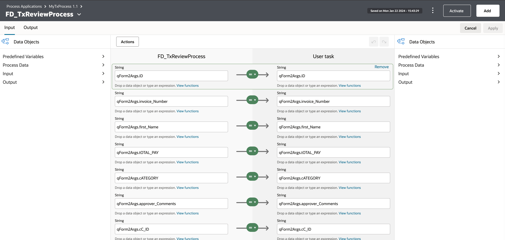
   14. A
   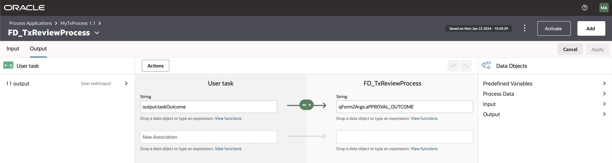
   15. A
   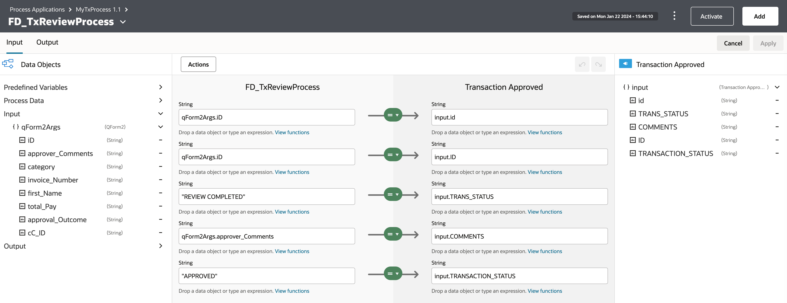
   16. A
   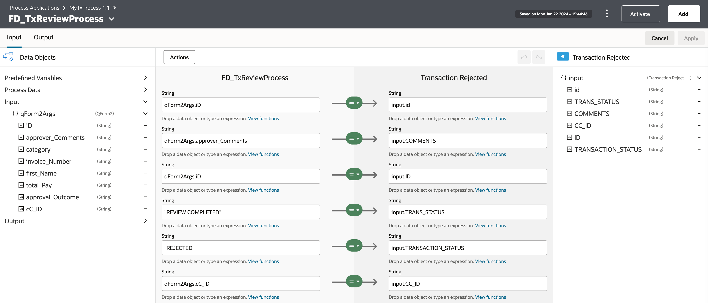
   17. A
   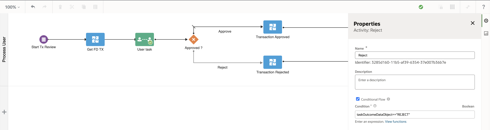
   18. A
   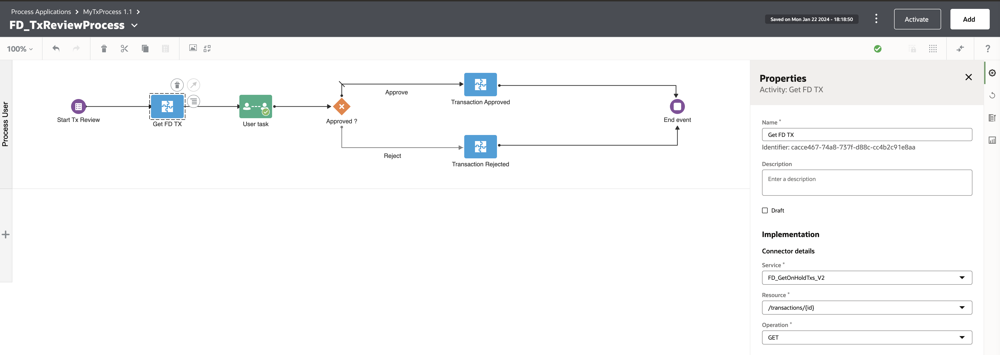

## Run Transaction Review Process

Add the following to your manifest.json in the top section:

   1. A
   

## Learn More

* [Oracle APEX](https://apex.oracle.com/en/)
* [Autonomous Database](https://www.oracle.com/in/autonomous-database/)
* [Anomaly Detection AI Service](https://www.oracle.com/in/artificial-intelligence/anomaly-detection/)
* [Document Understanding](https://www.oracle.com/in/artificial-intelligence/document-understanding/)
* [Process Automation](https://www.oracle.com/in/integration/process-automation/)
* [Analytics Platform](https://www.oracle.com/in/business-analytics/analytics-platform/)
* [AI Language](https://www.oracle.com/in/artificial-intelligence/language/)
* [Oracle Digital Assistant](https://www.oracle.com/in/chatbots/)

## Acknowledgements

* **Author** - Architect, Author and Developer - Madhusudhan Rao B M, Principal Product Manager, Oracle Database
* **Last Updated By/Date** - Jan 22nd, 2024
